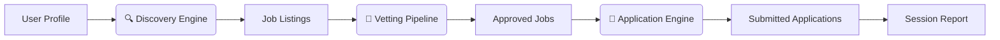

# AutoApply (ALMOST-READY)

AutoApply is an intelligent automation system designed to streamline the job search and application process. It provides a modular framework for discovering job postings, filtering relevant listings, and submitting applications automatically with minimal user intervention.

---

## Shout Outs

<div align="center">
   CHELSEA DAHL

   <br>

   *This project would've never been possible without the kindness and support of Chelsea, Grant, and everyone else from the Austin, TX office! I could never thank them enough!*
</div>

---

## 1. Overview

AutoApply automates the process of identifying and applying to job listings across multiple platforms. It includes a robust evasion framework to prevent detection by web platforms, a dynamic scraping system, and a user interface that enables configuration and monitoring of all activities.

---

## 2. ✨ Features (1000% FREE & Open Source)

- **🧠 Intelligent Vetting** – Configurable filter chain (title, skills, location, experience) powered by **SpaCy** and a **local LLM** (GPT4All) for borderline decisions.  
- **🕵️ Undetectable Automation** – Multi‑layer evasion: browser fingerprint spoofing, human‑like mouse / typing cadence, CAPTCHA detection, and automatic fallback to static HTML when no browser is available.  
- **🔗 Multi‑Platform Discovery** – Searches **Google**, **Bing**, and **Indeed** (LinkedIn and DuckDuckGo coming soon). A **YAML‑driven ATS registry** lets you add new platforms without writing code.  
- **🧩 Plug & Play Architecture** – Hexagonal (ports & adapters) design makes it trivial to swap browser drivers (Selenium ↔ Playwright), persistence backends, or AI engines.  
- **🖥️ GUI + CLI** – Tkinter desktop app for visual monitoring and a full‑featured terminal dashboard for SSH / library computers.  
- **💾 Portable Mode** – Runs entirely from a USB stick; zero admin rights, zero traces on the host machine.  
- **📊 Research‑Grade Telemetry** – Opt‑in, zero‑PII signal collection that produces a uniform CSV dataset ready for pandas / R / academic analysis.  
- **🎛️ Flexible Session Controls** – Human‑in‑the‑loop checkpoints, pausing, crash‑recovery checkpoints, and per‑company rate limiting.  

---

## 3. 🚀 Quick Start

### 3.1 📦 Installation

```bash
# Core install (~30 MB, works with your system browser)
pip install auto_apply

# Optional upgrades (install only what you need):
pip install "auto_apply[nlp]"      #  SpaCy for smarter vetting (~685 MB model download separately)
pip install "auto_apply[browser]"  #  Playwright for enhanced stealth
pip install "auto_apply[ai]"       #  GPT4All local LLM for open‑ended questions
pip install "auto_apply[all]"      #  Everything at once
```

### 3.2 ⚡ First Run

```bash
python -m auto_apply          # Launches the GUI (recommended)
python -m auto_apply --cli    # Terminal‑only mode
```

The first launch opens the **Setup Wizard** – you only need to fill in your name, email, and resume path once.  
After that, every job hunt is a single click or command.

### 3.3 💾 USB Portable (No Installation)

If you cannot install software, download the pre‑built **AutoApply‑portable.zip** from [GitHub Releases](https://github.com/Liebmann5/AA/releases), extract it to a USB drive, and run `AutoApply.exe`. Everything – Python, browsers, data – stays on the flash drive.

---

## 4. 📁 Project Structure

```
AA/
├── packages/auto_apply/
│   ├── docs/                  # Architecture Decision Records, user & developer guides
│   ├── src/auto_apply/
│   │   ├── domain/            # Pure business logic: models, ports, algorithms
│   │   ├── application/       # Workflows (Discovery, Vetting, Applications) & services
│   │   ├── adapters/          # Concrete implementations (Selenium, Playwright, BS4, …)
│   │   ├── infrastructure/    # Composition root, browser cascade, capabilities registry
│   │   └── resources/         # YAML configs, ATS descriptors, i18n, profile templates
│   └── tests/                 # Test suite mirroring src/ layout
├── pyproject.toml             # Workspace root (uv monorepo)
├── AA_ARCHITECTURE_BIBLE.md   # The single authority on every design decision 📖
└── README.md
```

---

## 5. 🧠 How It Works

AutoApply acts as an autonomous agent.  The core loop is:



1. **Discovery** – searches multiple job boards simultaneously (Google, Bing, Indeed) using real browser navigation or static HTTP fallback.  
2. **Vetting** – runs every listing through a configurable chain of filters (throttling, location, skills, title similarity) to determine if the job matches your profile.  
3. **Application** – fills out forms automatically using your stored data; pauses at human‑review checkpoints so you always have the final say.

Everything is coordinated by the **AgentOrchestrator**, an event‑driven state machine that handles crashes, network loss, CAPTCHAs, and retries without losing progress.

> For a deep dive, read the [Architecture Bible](AA_ARCHITECTURE_BIBLE.md) or browse the [ADR index](packages/auto_apply/docs/adr/index.md).

---

## 6. 🛠️ Configuration

- **User Profile** – created by the Setup Wizard and editable in the GUI settings.  It stores your personal info, search preferences, skills, and behavior preferences.  
- **runtime_defaults.yaml** – master fallback for every tunable parameter (timeouts, concurrency, NLP thresholds).  Power users can edit this file directly.  
- **Admin Policy** – IT administrators can drop an `aa_policy.json` next to the executable to lock down settings (allowed browsers, headless mode, rate limits) on shared machines.  

All configuration layers are merged at startup; no hard‑coded defaults can override the YAML.

---

## 7. 🤝 Contributing

We welcome contributions of all kinds – bug reports, feature ideas, documentation, and code.  
Please read [`CONTRIBUTING.md`](packages/auto_apply/CONTRIBUTING.md) for the branch strategy, commit conventions, and pull request checklist.

- **Architecture** – check the [Architecture Bible](AA_ARCHITECTURE_BIBLE.md) and the [ADR records](packages/auto_apply/docs/adr/index.md).  
- **Developer Setup** – `uv sync` inside the repo root gives you a full development environment (pytest, ruff, black, mkdocs).  
- **First Contribution** – adding a new ATS platform is a single YAML file; see [Adding an ATS Platform](packages/auto_apply/docs/developer_guide/adding_an_ats_platform.md).

---

## 8. 📄 License

AutoApply is released under the **MIT License**.  
See the [LICENSE](LICENSE) file for the full text.

---

*“The purpose of AA was to provide people/candidates with the same automating computer programs that companies utilize to expedite and simplify the hiring process — then provide the data to build something better.”*