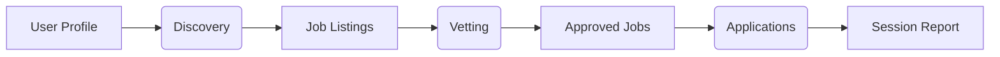

# AutoApply

**Deterministic, local, zero-shot comprehension of unfamiliar web interfaces — applied to job applications.**

[](https://github.com/Liebmann5/AA/actions/workflows/ci.yml)
[](https://www.python.org/downloads/)
[](LICENSE)
[](packages/auto_apply/docs/STATUS.md)

---

## Read this first

**AutoApply has never been released and has never successfully submitted a job
application.** The most recent full live run made 18 attempts and produced 0
submissions: 13 were stopped by CAPTCHA challenges and 5 by login walls.

That number is published deliberately. AA exists to test a falsifiable claim,
and the claim is not yet proven. Before you install anything, read
**[STATUS.md](packages/auto_apply/docs/STATUS.md)** — the single source of truth
for what works, what is wired but unproven, and what is aspiration. Every other
document in this repository defers to it.

---

## The claim

A local program, on commodity hardware, with no network AI, no API keys and no
site-specific knowledge, can comprehend an unfamiliar web interface well enough
to operate it — and produce a verifiable record of what it encountered.

AA calls this **deterministic local web-interface comprehension**. Job
applications are the first domain, not the definition.

Concretely, that means AA reads pages *geometrically* rather than through
hardcoded selectors: Kuhn–Munkres (Hungarian) assignment to pair labels with
inputs, convex hulls and VIPS-style segmentation to find regions, structural
hashing that deliberately ignores CSS class names, entropy and occlusion
measures to spot honeypots. There is no per-site selector table, because a
selector table cannot describe a page nobody has seen.

The constraint is the contribution. Anyone can comprehend a page by posting it
to a frontier model. Doing it with geometry and constraint solving, on a
four-gigabyte library computer running off a USB stick with no administrator
rights, is the part that is novel — and the part that keeps the results
deterministic, reproducible and research-grade.

**This claim may be false.** The counter-arguments are stated at full strength
in the [Architecture Bible](packages/auto_apply/docs/AA_ARCHITECTURE_BIBLE.md),
along with what evidence would falsify it.

---

## What AA does today

| Capability | State |
| --- | --- |
| Discover postings via Google, Bing and Indeed | **Partial** — only Bing has yielded real postings in live runs |
| Vet postings against a profile (title, location, skills, salary) | **Working** |
| Fill application forms from a stored profile | **Working, unproven end-to-end** |
| Submit an application | **Never achieved** — 0 of 18 attempts |
| Run from a USB stick with no admin rights | **Working** |
| Record an auditable, opt-in research dataset | **Working** |
| Operate with no browser at all | **Removed** — see [ADR-013](packages/auto_apply/docs/adr/013_static_path_retirement.md) |

A live browser is now **required**. AA refuses to start a session rather than
pretending to run without one.

---

## Requirements

- Python 3.10 or newer (3.10 and 3.12 are both exercised in CI)
- One of Chrome, Chromium, Firefox or Edge
- ~300 MB of disk for a core install; no administrator rights needed
- No API keys, no account, no network service

---

## Install

AA is **not yet on PyPI**. Install from a source checkout:

```bash
git clone https://github.com/Liebmann5/AA.git
cd AA
pip install uv
uv sync
uv run --package auto_apply python -m auto_apply
```

Full instructions, including the USB-portable path, are in the
**[Installation Guide](packages/auto_apply/docs/getting_started/installation.md)**.

---

## Documentation

| I want to… | Start here |
| --- | --- |
| Know what actually works | [STATUS.md](packages/auto_apply/docs/STATUS.md) |
| Install and run AA | [Getting Started](packages/auto_apply/docs/getting_started/index.md) |
| Use AA day to day | [User Guide](packages/auto_apply/docs/user_guide/index.md) |
| Contribute code | [CONTRIBUTING.md](CONTRIBUTING.md) |
| Understand the architecture | [Architecture](packages/auto_apply/docs/architecture/index.md) |
| See why a decision was made | [ADR index](packages/auto_apply/docs/adr/index.md) |
| Look something up | [Reference](packages/auto_apply/docs/reference/index.md) |
| Use AA's research output | [Research Module](packages/auto_apply/docs/research_module/index.md) |
| Report a vulnerability | [SECURITY.md](SECURITY.md) |
| Cite AA | [CITATION.cff](CITATION.cff) |

The documentation is built with MkDocs from `packages/auto_apply/docs/`.

---

## How it works


```mermaid
graph LR
    A[User Profile] --> B(Discovery)
    B --> C[Job Listings]
    C --> D(Vetting)
    D --> E[Approved Jobs]
    E --> F(Applications)
    F --> G[Session Report]
```

Three engines share one priority queue. A single search flows discover → vet →
apply before the next search begins, so results arrive steadily rather than in
one batch at the end ([ADR-011](packages/auto_apply/docs/adr/011_discovery_pipeline_priority.md)).
Submission is fail-closed: if AA cannot prove a form was filled correctly, it
refuses to submit ([ADR-012](packages/auto_apply/docs/adr/012_fail_closed_submission_gate.md)).

---

## Research use

AA doubles as a research instrument. With explicit opt-in consent it records
anonymised signals about hiring-system behaviour — ghost postings, salary
disclosure, qualification inflation, accessibility barriers — and exports them
as NDJSON, CSV and JSON-LD suitable for Zenodo or OSF deposit.

Collection is off by default, consent is versioned, personal data is salted and
hashed, and the consent dialogue is reproduced verbatim in
[RESEARCH_CONSENT_DIALOG.md](packages/auto_apply/docs/RESEARCH_CONSENT_DIALOG.md).
Reproduction instructions are in
[REPRODUCIBILITY.md](packages/auto_apply/docs/REPRODUCIBILITY.md).

---

## Responsible use

Automating interaction with job boards may conflict with their terms of
service, and using AA is your decision and your responsibility. AA does not
solve CAPTCHAs, does not store credentials by default, and does not invent
claims on your behalf. Read the
**[DISCLAIMER](DISCLAIMER.md)** and **[ETHICS](packages/auto_apply/docs/ETHICS.md)**
before your first run.

---

## Contributing

Contributions are welcome — including documentation, testing on unusual
hardware, and simply running AA and reporting what broke. Start with
[CONTRIBUTING.md](CONTRIBUTING.md) and the
[Code of Conduct](CODE_OF_CONDUCT.md).

The most valuable contribution right now is not code: it is running AA on a
machine that is not the maintainer's and telling us what happened.

---

## Project

- **Maintainer:** Nicholas Liebmann ([@Liebmann5](https://github.com/Liebmann5))
- **Canonical repository:** <https://github.com/Liebmann5/AA>
- **Mirror:** <https://codeberg.org/Liebmann5/AutoApply>
- **Licence:** [MIT](LICENSE)
- **Governance:** [GOVERNANCE.md](GOVERNANCE.md)

---

> *The purpose of AA was to provide candidates with the same automating
> programs companies use to expedite hiring — then provide the data to build
> something better.*

## Acknowledgements

This project would not exist without the kindness and support of Chelsea Dahl,
Grant, and everyone else from the Austin, TX office.
