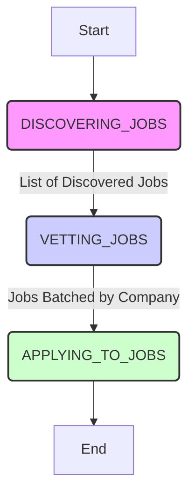

# The Agent Lifecycle: A State Machine Approach

The entire application is being refactored from a linear script (`WorkflowOrchestrator`) into a robust, high-level state machine: the `AgentOrchestrator`.

A state machine is a design pattern where a system can only be in one "state" or "mode" at any given time. This approach makes the agent's logic far more predictable, testable, and resilient to errors compared to a simple, top-to-bottom script. The `AgentOrchestrator` acts as the "CEO" of the agent, transitioning it through a series of well-defined states that represent its entire lifecycle.

## The Lifecycle Flow

The agent moves through four distinct states, passing data from one to the next.

---

## The States Explained

Each state has a single, clear responsibility and is designed to be a self-contained, testable unit.

### 1. `DISCOVERING_JOBS` (The "Hunter")

*   **Responsibility:** To find job opportunities from multiple sources.
*   **Implementation:** This state manages and deploys a series of modular "Discovery Strategies" (e.g., `GoogleSearchStrategy`, `BingSearchStrategy`).
*   **Key Feature:** It will use a nested, low-level state machine (`ScrapingMachine`) to handle complex, interactive job widgets on sites like Google and LinkedIn. This machine performs a "click-and-wait" process: click a job card, wait for the details panel to load, and then extract the final "Apply" link.

### 2. `VETTING_JOBS` (The "Analyst")

*   **Responsibility:** To analyze all discovered jobs and approve only those that are a perfect "Two-Way Fit." A two-way fit means the job aligns with the user's needs, and the user's profile aligns with the job's requirements.
*   **Implementation:** This state will run a `VettingPipeline` that processes jobs through a series of modular filters.
*   **Key Features:**
    *   **`RoleAlignmentFilter`:** This critical filter will use a free, lightweight, offline **Sentence Transformer** model to calculate the conceptual similarity between a job's title and the user's desired titles. This provides an AI-driven, logical check to prevent mismatches (e.g., "Principal Engineer" vs. "School Principal").
    *   **Application Throttling:** The pipeline will include a `ThrottlingFilter` that checks against a persistent database of company-specific application rules (e.g., "only apply once every 6 months").
    *   **Company-Based Batching:** The final output of this state will be a dictionary where jobs are grouped by company name. This is essential for efficient and stealthy application batching in the next state.

### 3. `APPLYING_TO_JOBS` (The "Executor")

*   **Responsibility:** To autonomously fill out and submit applications for all vetted jobs.
*   **Implementation:** This state will iterate through the batched jobs from the previous state. For each application, it will deploy a nested `FormFillingMachine`.
*   **Key Features:**
    *   **Heuristic Form Filling:** The form-filling engine will not use hardcoded selectors. It will be driven by a `HeuristicFormFiller` that finds form fields by their human-readable `<label>` text, using a configurable synonym dictionary.
    *   **AI-Powered Custom Answers:** For open-ended questions ("Is there anything else you'd like to tell us?"), the engine will use the same Sentence Transformer model to find the most conceptually relevant paragraph from the user's own `work_experience` descriptions to use as an intelligent, contextual answer.
    *   **Post-Submission Analysis:** After submitting an application, the machine will scan the "Thank You" page for throttling keywords (e.g., "wait 6 months") and update the database accordingly.

---
## What's Next?
Now that we have the high-level overview, let's take a deeper look at the core abstractions that make the entire system possible.

➡️ **Next: [Core Abstractions](02_core_abstractions.md)**