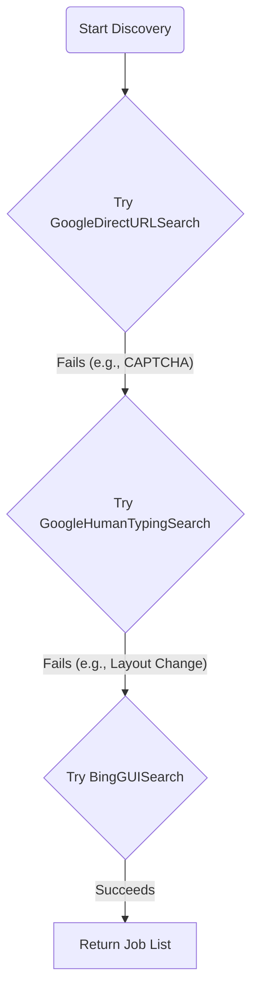

# Discovery Strategies: The Adaptive Search Engine

The first active state of the agent is `DISCOVERING_JOBS`. The goal of this state is to find job opportunities. A naive approach would be to write a single, complex script for one website. This is brittle and will break the moment a website changes its layout.

Our solution is an adaptive, multi-strategy search engine, orchestrated by the `AdaptiveSearchManager`.

## The Strategy Pattern

This engine is built on the **Strategy Pattern**. Instead of one monolithic scraper, we have a series of smaller, independent "strategy" classes, each designed to scrape a specific source in a specific way.

The `AdaptiveSearchManager` acts as a pipeline. It tries each strategy, one by one, in a prioritized order until one of them succeeds.



This design provides incredible resilience. If Google blocks our direct URL approach, the manager simply moves on and tries the human-typing approach. If all Google strategies fail, it moves on to Bing.

## The `BaseSearchStrategy` Contract

To make this "pluggable" system work, every search strategy must follow a strict contract, defined by the `BaseSearchStrategy` abstract class. Its core requirement is to implement a `search` method that returns a `StrategyResult` object.

```python
# From: src/auto_apply/scraping/search/base_search_strategy.py

@dataclass
class StrategyResult:
    success: bool
    results: List[SearchResult] = field(default_factory=list)
    failure_reason: Optional[str] = None

class BaseSearchStrategy(ABC):
    @abstractmethod
    def search(self) -> StrategyResult:
        ...
```

This standardized result allows the `AdaptiveSearchManager` to understand the outcome of any strategy. A strategy can fail gracefully (e.g., by returning `success=False`) without crashing the entire application.

## How to Add a New Job Source (e.g., LinkedIn)

This architecture makes it incredibly easy to add new job sources. Here is the workflow:

1.  **Create a New Strategy Class:**
    Create a new file, `linkedin_gui_search.py`, in the `scraping/search` directory. Inside, create a class that inherits from `BaseSearchStrategy`.

    ```python
    # src/auto_apply/scraping/search/linkedin_gui_search.py
    from .base_search_strategy import BaseSearchStrategy, StrategyResult

    class LinkedInGUISearch(BaseSearchStrategy):
        def __init__(self, browser, ...):
            # ... constructor ...

        def search(self) -> StrategyResult:
            logger.info("--- Executing Strategy: LinkedIn GUI Search ---")
            try:
                # ... scraping logic for LinkedIn ...
                # On success:
                return StrategyResult(success=True, results=found_jobs)
            except Exception as e:
                # On a graceful failure:
                if "captcha" in str(e).lower():
                    return StrategyResult(success=False, failure_reason="CAPTCHA_DETECTED")
                # On a critical failure, re-raise the exception
                raise e
    ```

2.  **Register the New Strategy:**
    In `core/workflow_orchestrator.py`, find the `_create_search_manager` method and simply register an instance of your new strategy in the desired order.

    ```python
    # src/auto_apply/core/workflow_orchestrator.py
    from ..scraping.search import ..., LinkedInGUISearch # 1. Import it

    def _create_search_manager(self, ...):
        search_manager = AdaptiveSearchManager()
        # ...
        search_manager.register_strategy(GoogleDirectURLSearch(...))
        search_manager.register_strategy(GoogleHumanTypingSearch(...))
        search_manager.register_strategy(BingGUISearch(...))
        search_manager.register_strategy(LinkedInGUISearch(...)) # 2. Register it
        return search_manager
    ```

That's it. The `AdaptiveSearchManager` will now automatically include your LinkedIn strategy in its pipeline. No other code needs to change.

---
## What's Next?
Once jobs have been discovered, they must be analyzed to ensure they are a good fit. This is the responsibility of the Vetting Pipeline.

➡️ **Next: [The Vetting Pipeline](05_vetting_pipeline.md)**