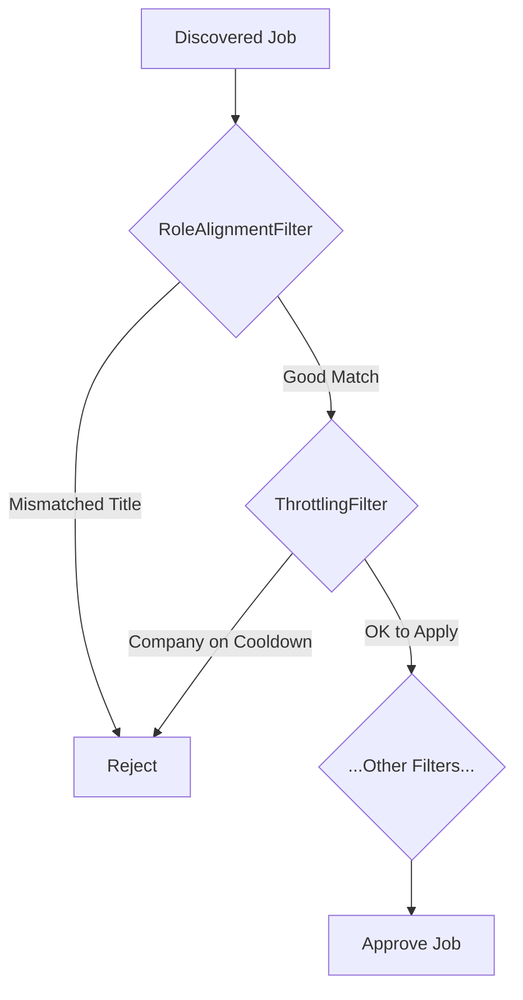

# The Vetting Pipeline: Ensuring a "Two-Way Fit"

Simply finding jobs isn't enough. A key feature that elevates the AutoApply Agent from a simple scraper to an intelligent assistant is its ability to *vet* opportunities. The `VETTING_JOBS` state is responsible for this analysis, which is performed by the **Vetting Pipeline**.

The goal of this pipeline is to approve only those jobs that are a perfect **"Two-Way Fit"**:
1.  **The job is a fit for the user:** It matches their desired roles, locations, and other preferences.
2.  **The user is a fit for the job:** Their experience and qualifications align with the company's requirements.

This prevents the agent from sending out low-quality, mismatched applications that would waste both the user's and the recruiter's time.

## The Pipeline Design

The `VettingPipeline` is designed as a series of modular, independent "filters." Each discovered job is passed through the pipeline, and if it fails the check at any filter, it is immediately rejected.



This design is highly extensible. We can easily add new filters to the pipeline to check for new criteria (e.g., a filter that rejects jobs with negative keywords in the description).

## Key Filters Explained

### `RoleAlignmentFilter` (The AI Brain)

This is the most critical and intelligent filter in the pipeline. Its purpose is to solve the problem of semantic ambiguity in job titles.

*   **The Problem:** A simple keyword search can't tell the difference between "Principal Engineer" (a software role) and "School Principal" (an education role). This leads to bad matches.
*   **The Solution:** This filter will use a free, lightweight, offline **Sentence Transformer** model (from the `sentence-transformers` library). Here's how it works:
    1.  The filter takes the job title from the posting (e.g., "Lead Backend Developer").
    2.  It takes the list of desired titles from the user's profile (e.g., "Software Engineer," "Backend Engineer").
    3.  The AI model converts all of these titles into numerical vectors that represent their *conceptual meaning*.
    4.  It then calculates the **cosine similarity** between the job's title vector and the user's desired title vectors.
    5.  If the similarity score is below a certain threshold (e.g., 0.75), the job is rejected as a conceptual mismatch.

This AI-driven approach ensures that the agent understands the *meaning* of the job titles, not just the keywords.

### `ThrottlingFilter`

This filter acts as the agent's "politeness" mechanism.

*   **The Problem:** Some companies request that applicants only apply for a limited number of roles within a certain time period (e.g., "only 3 applications every 6 months"). Spamming applications is a bad look.
*   **The Solution:** This filter will check the job's company against a persistent database.
    1.  When an application is submitted, the `Application Engine` will scan the "Thank You" page for keywords like "wait 6 months."
    2.  If found, it adds an entry to the database for that company with a cooldown timestamp.
    3.  The `ThrottlingFilter` checks this database. If a company is on cooldown, it rejects all jobs from that company until the cooldown expires.

## Final Output: Batching by Company

The final, crucial output of the `VETTING_JOBS` state is not just a list of approved jobs, but a **dictionary where jobs are grouped by company name**.

```json
{
  "Google": [
    { "title": "Software Engineer", "url": "..." },
    { "title": "Backend Engineer", "url": "..." }
  ],
  "Netflix": [
    { "title": "Senior Engineer, L5", "url": "..." }
  ]
}
```

This batching is essential for the next state, `APPLYING_TO_JOBS`, as it allows the agent to apply to all jobs at one company in a single, efficient session.

---
## What's Next?
After jobs have been discovered and vetted, the final step is to apply to them. This is the job of the Application Engine.

➡️ **Next: [The Application Engine](06_application_engine.md)**