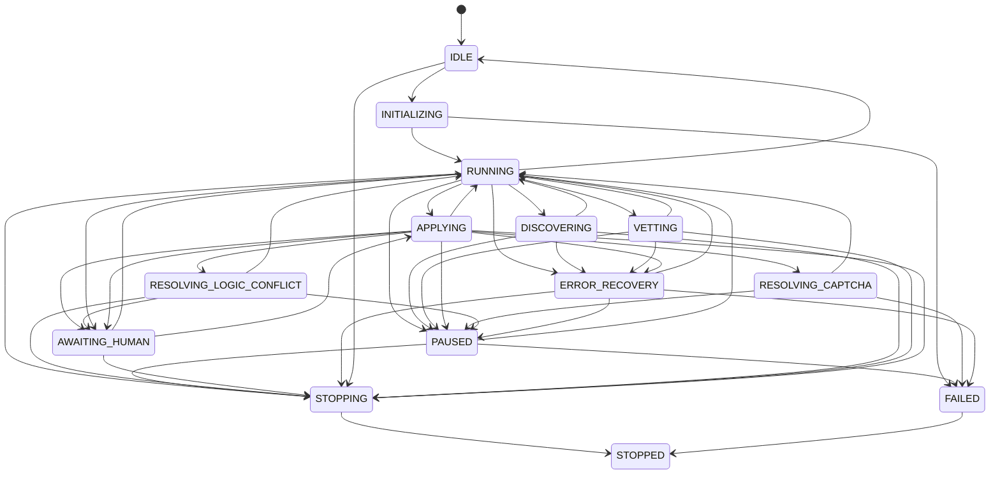

# Agent Lifecycle

The `AgentOrchestrator` is the brain of AutoApply. It does not follow a
hardcoded script. Instead, it operates as an **event‑driven, priority‑queue
dispatcher** — a central loop that reads work units, routes them to the
correct engine, and reacts to the results by generating new work.

This design is what makes AA resilient: the orchestrator can survive browser
crashes, network outages, and unexpected form failures without losing progress.

---

## The State Machine

The orchestrator is always in exactly one of fourteen states. Transitions
are guarded — the orchestrator cannot jump from `APPLYING` directly to
`IDLE` without passing through the correct path. This makes the agent's
behaviour auditable and prevents an entire class of concurrency bugs.

| State | Meaning |
| ----- | ------- |
| `IDLE` | No active session. Waiting for input. |
| `INITIALIZING` | Session setup: registry, policy enforcement, browser cascade, checkpoint recovery. |
| `RUNNING` | Main event loop is processing tasks. |
| `DISCOVERING` | A DISCOVER task is active. DiscoveryEngine has the browser. |
| `VETTING` | A VET task is active. VettingEngine is analysing a job. |
| `APPLYING` | An APPLY task batch is active. ApplicationEngine is filling a form. |
| `PAUSED` | Execution suspended (user request, network loss, CAPTCHA). Browser stays alive. |
| `RESOLVING_CAPTCHA` | CAPTCHA resolution service is active. |
| `RESOLVING_LOGIC_CONFLICT` | A form field conflict requires user input. |
| `AWAITING_HUMAN` | Paused at a HITL checkpoint, waiting for user approval. |
| `ERROR_RECOVERY` | Attempting self‑healing after a recoverable error. |
| `STOPPING` | Shutting down; current task will complete. |
| `STOPPED` | Session ended cleanly. Terminal state. |
| `FAILED` | Unrecoverable error. Terminal state — teardown will reach `STOPPED`. |

The state machine is thread‑safe: `transition_to()` acquires a lock, checks
the transition table, evaluates any registered guards, and records the
transition in an audit history. Invalid transitions are logged and return
`False` rather than raising — the orchestrator continues in its current state.

---

## The Work Queue

AA does not hardcode a sequence of steps. Instead, all work is represented
as `WorkUnit` objects in a persistent SQLite priority queue.

### Task types

| Task Type | Priority (default) | What it does |
| --------- | ------------------ | ------------ |
| `DISCOVER` | 5 | Search for jobs matching criteria. Produces VET tasks. |
| `DISCOVER_COMPANY` | 4 | Scrape a company careers page. Produces VET tasks. |
| `VET` | 5 | Evaluate a single job against the user profile. Produces APPLY tasks. |
| `APPLY` | 1 | Fill out and submit an application form. Highest execution priority. |
| `HANDLE_CAPTCHA` | 1 | Attempt automatic CAPTCHA resolution; escalate to manual if needed. |

Lower priority numbers are processed first. APPLY tasks get priority 1
because a vetted job sitting idle wastes the browser session. DISCOVER tasks
run at priority 5 because they generate more work — they are processed when
nothing more urgent is pending.

### Task lifecycle

1. **Queued** — written to the database with status `PENDING`.
2. **Dequeued** — the event loop picks the highest‑priority pending task and
   marks it `IN_PROGRESS` atomically.
3. **Dispatched** — routed to the correct engine handler.
4. **Completed** — marked `COMPLETED` on success.
5. **Failed** — re‑queued with a lower priority and an incremented retry count.
   After `MAX_TASK_RETRIES` (default 3), the task is marked `PERMANENTLY_FAILED`
   and logged for analysis.

If AA crashes while a task is `IN_PROGRESS`, the database recovers it on the
next startup — it is reset to `PENDING` and picked up again.

### Deduplication

Before any task whose payload is a `Job` is dispatched, the orchestrator
checks two levels of deduplication:

1. **In‑session** — a `DeduplicationManager` tracks every URL seen since the
   orchestrator started. It normalises URLs (strips tracking parameters) and
   extracts platform‑specific job IDs (LinkedIn, Indeed, Greenhouse, etc.) to
   catch the same job appearing via different URLs.
2. **Cross‑session** — `JobRepositoryPort.was_applied()` checks the persistent
   application history database. AA will never apply to a URL that was
   successfully submitted in any prior session.

---

## The Main Event Loop

The orchestrator's `run()` method is a single `while self.running` loop.
Each iteration:

1. **Pause check** — if `paused` is `True` (from a health monitor or user
   action), sleep and retry.

2. **Batch readiness** — if any company bucket in the application buffer has
   reached `BATCH_THRESHOLD` (default 3 jobs), flush that batch now. This
   keeps applications to the same company contiguous, reducing browser
   navigation overhead.

3. **Dequeue** — call `task_queue.get_next_task()`. If the queue is empty,
   flush all remaining company batches (regardless of size), then idle for
   `IDLE_SLEEP_SECONDS` before checking again.

4. **Deduplication** — if the task payload is a `Job`, check both in‑session
   and cross‑session dedup. Duplicates are skipped with a log message.

5. **Browser readiness** — if the task requires a live browser (`APPLY`,
   `VET`, `HANDLE_CAPTCHA`, and optionally `DISCOVER`), the orchestrator
   verifies that a browser driver is active. If the browser died mid‑session,
   the `BrowserHealthMonitor` will have signalled `BROWSER_UNHEALTHY` and
   the orchestrator will attempt a cascade restart.

6. **Network readiness** — if the `NetworkHealthMonitor` reports
   `NETWORK_UNHEALTHY`, the orchestrator pauses and waits for reconnection
   (up to a configurable timeout, default 5 minutes).

7. **Dispatch** — the task is routed to the correct handler method:
   `_handle_discovery()`, `_handle_company_discovery()`, `_handle_vetting()`,
   `_buffer_application()`, or `_handle_captcha()`.

8. **Mark complete** — on success, the task is marked `COMPLETED` in the
   database.

9. **Checkpoint** — every `CHECKPOINT_INTERVAL` (default 5) completed tasks,
   the current session state is saved atomically to disk. If the process
   dies, the next session resumes from the most recent checkpoint.

---

## Company Batching

Rather than applying to jobs one at a time in random order, the orchestrator
buffers `APPLY` tasks by company. When a company bucket reaches
`BATCH_THRESHOLD` jobs, AA navigates to that company's ATS domain once and
submits all applications in sequence. This:

- Reduces browser navigation overhead (one navigation per company, not per job).
- Looks more human (a person would review multiple roles at one company before
  leaving the site).
- Respects per‑company rate limits enforced by the `ThrottlingFilter`.

At queue exhaustion, all remaining buffers are flushed regardless of size —
no job is left unapplied.

---

## Checkpoint & Recovery

Checkpointing is what makes AA resilient to crashes, power loss, and
accidental termination.

- **What is saved:** Session statistics (jobs discovered, vetted, applied,
  failed), the current `AgentState`, and the pending application batch
  buffers. Everything needed to resume.
- **What is NOT saved:** Browser cookies, in‑flight page state, or raw driver
  references — those cannot be reliably restored and will be re‑acquired on
  resume.
- **When:** Every `CHECKPOINT_INTERVAL` completed tasks, and on clean
  shutdown.
- **How:** Atomic write‑to‑temp + rename. If the process dies mid‑write, the
  previous checkpoint is intact.
- **Recovery:** On startup, `AgentOrchestrator._attempt_checkpoint_recovery()`
  loads the most recent checkpoint and restores the session context. The work
  queue's `IN_PROGRESS` tasks are also recovered — reset to `PENDING`.

The combination of the persistent work queue (database) and volatile
checkpoints (JSON files) provides complete crash recovery without any data
loss.

---

## Health Monitors

Two background daemon threads watch the browser and the network. They
communicate exclusively through the `EventBus` — they never call the
orchestrator directly.

### BrowserHealthMonitor

- Runs a `driver.title` call every 10 seconds (the lightest possible browser
  command).
- If the browser is slow but responsive, publishes `BROWSER_DEGRADED`.
- If the browser fails to respond for 3 consecutive checks, publishes
  `BROWSER_UNHEALTHY`.
- The orchestrator subscribes to `BROWSER_UNHEALTHY` and triggers a cascade
  restart — tearing down the dead driver and acquiring a new one.

### NetworkHealthMonitor

- Uses only the Python standard library — a raw TCP socket to `1.1.1.1:80`.
  No external dependencies, no DNS lookup.
- If all TCP checks fail, attempts an HTTP HEAD request as a last resort.
- Publishes `NETWORK_UNHEALTHY` after 2 consecutive failures (default 60
  seconds of silence).
- The orchestrator pauses the main loop and waits for `NETWORK_RESTORED`.
  If the network is down for longer than the configured timeout, the session
  is stopped cleanly.

Both monitors run as daemon threads and are started in `run()`. If they
cannot be initialised (e.g. missing import on a minimal system), the
orchestrator runs without health monitoring — graceful degradation.

---

## Threading Model

The orchestrator runs on a **single main thread**. The event loop is
synchronous. Background health monitors run on separate daemon threads.
There is no asyncio — this is a deliberate choice for compatibility with
lowest‑spec hardware and the Tkinter GUI, which requires a single main
thread for widget updates.

The `EventBus` is thread‑safe: `publish()` snapshots the subscriber list
under a lock, then calls handlers outside the lock. Handlers are called on
the publishing thread — if a monitor thread publishes `BROWSER_UNHEALTHY`,
the orchestrator's handler runs on that monitor thread. Handlers are
designed to only set flags or enqueue work, never to mutate shared state
directly.

---

## Error Handling & Retry

Every task dispatch is wrapped in a `try/except`. If a task raises an
exception:

1. The exception is logged with full traceback.
2. The task's retry counter (stored in `context_data`) is incremented.
3. If retries remain, the task is re‑queued with slightly lower priority.
4. If retries are exhausted, the task is marked `PERMANENTLY_FAILED` and
   a `TASK_PERMANENTLY_FAILED` event is published for telemetry.

The event loop itself never crashes. An unhandled exception in a handler is
caught by the loop wrapper, logged, and the loop continues to the next
iteration. The orchestrator can run indefinitely, surviving transient
failures in any subsystem.

---

## Next Steps

- [Core Abstractions](core_abstractions.md) — the ports and adapters that
  make the orchestrator framework‑agnostic.
- [Browser Cascade](browser_cascade.md) — how the orchestrator acquires and
  recovers its browser driver.
- [Application Engine](application_engine.md) — what happens inside an
  `APPLY` task, from form detection to submission.