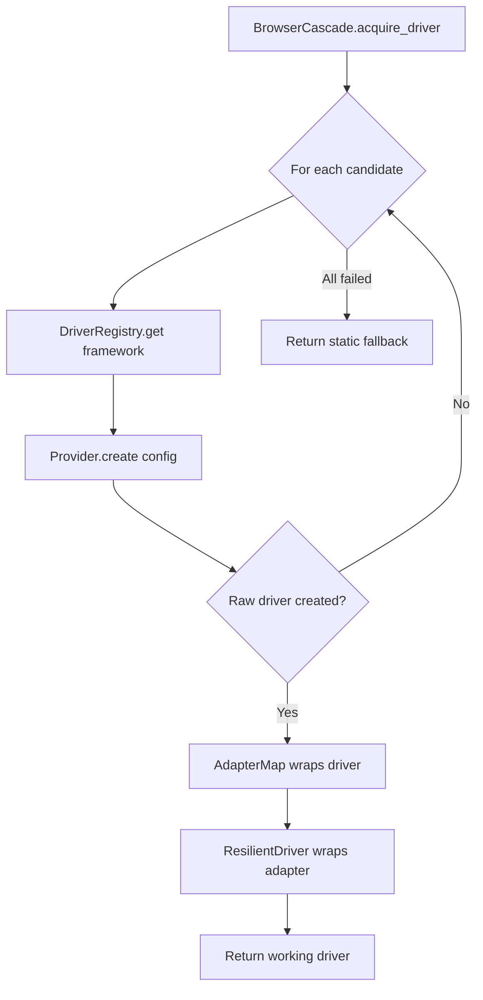

# Browser Cascade

AutoApply must work on library computers with no admin rights, on machines
where Chrome is outdated, on systems where only Firefox is installed, and on
flash drives that can be plugged into any computer with any browser
configuration. **The Browser Cascade** is the component that guarantees AA
always finds a working browser — and if no browser can be launched, it falls
back to a static HTML parser so the user can still discover jobs.

This chapter explains how AA selects a browser, tries fallback options when
things go wrong, and can be extended with new automation tools.

---

## The Problem: No Single Browser Works Everywhere

A naive automation tool assumes "Chrome is installed at this path and has
this version." On real‑world machines this assumption breaks constantly:

- Chrome may be outdated relative to the ChromeDriver version.
- Playwright's bundled Chromium may not be downloaded yet (300 MB on a
  metered connection).
- The machine may have only Firefox.
- A library admin may have blocked all browsers except Edge.
- The user may be running from a USB drive with a portable Chromium binary
  and no system‑installed browsers at all.

AA solves this with a **priority‑ordered fallback list**. It tries the best
option first, and if that fails, moves to the next. If every live‑browser
attempt fails, it falls back to static HTML parsing — no browser needed.

---

## The Three Components

The cascade is built from three cooperating parts:

1.  **DriverProvider** — a single automation tool (Selenium, Playwright,
    Camoufox, etc.) that knows how to launch a specific type of browser.
2.  **DriverRegistry** — a collection of installed providers.
3.  **BrowserCascade** — the fallback loop that tries each candidate in
    priority order until one succeeds.



---

## DriverProvider — The Per‑Tool Contract

Every automation tool is represented by a class that implements the
`DriverProvider` protocol. The protocol asks four questions:

```python
class DriverProvider(Protocol):
    @property
    def name(self) -> str: ...
    @property
    def available(self) -> bool: ...
    def supports(self, browser_type: str) -> bool: ...
    def create(self, config: dict) -> Any: ...
    def cleanup(self, driver: Any) -> None: ...
```

| Method | Purpose |
| ------ | ------- |
| `name` | Canonical identifier: `"selenium"`, `"playwright"`, etc. |
| `available` | Is the underlying Python package installed and importable? |
| `supports(browser)` | Can this provider drive `"chrome"`, `"firefox"`, `"chromium"`, etc.? |
| `create(config)` | Launch a browser and return a raw driver object. |
| `cleanup(driver)` | Release all OS resources held by the driver. |

The beauty of this design is that each provider **encapsulates all its own
setup logic**. `SeleniumProvider` knows about ChromeDriver version mismatches,
container flags, and `undetected‑chromedriver`. `PlaywrightProvider` knows
about bundled binaries, persistent contexts, and the `--no‑sandbox` flag.
The cascade never needs to understand these details.

### Example: SeleniumProvider.create()

```python
def create(self, config: dict) -> Any:
    browser_type = config.get("browser_type", "chrome")
    headless = config.get("headless", False)
    
    if browser_type == "chrome":
        opts = ChromeOptions()
        opts.add_argument("--no-sandbox")
        opts.add_argument("--disable-dev-shm-usage")
        if headless:
            opts.add_argument("--headless=new")
        return webdriver.Chrome(options=opts)
    
    elif browser_type == "firefox":
        opts = FirefoxOptions()
        if headless:
            opts.add_argument("--headless")
        return webdriver.Firefox(options=opts)
    # ...
```

All the Selenium‑specific code lives here. The cascade never imports
`selenium.webdriver`.

---

## DriverRegistry — What Is Installed?

The `DriverRegistry` is a simple container that holds all available
providers. Providers register themselves at startup (in the composition
root). If a provider is not available (its Python package isn't installed),
registration is skipped with a logged warning — AA starts without it.

```python
registry = DriverRegistry()
registry.register(SeleniumProvider())    # only if selenium is installed
registry.register(PlaywrightProvider())  # only if playwright is installed
```

The registry answers three queries:

- `get_providers()` → all registered providers
- `get_providers_for_browser("firefox")` → providers that support Firefox
- `get("selenium")` → the specific provider named "selenium"

---

## AutomationCandidate — The Priority List

The order in which browsers are tried is defined by a hardcoded priority list
in `infrastructure/candidates.py`. Each candidate is a triple of `(framework,
browser_type, source)`:

```python
CANDIDATE_PRIORITY = [
    ("playwright",  "chromium", "bundled"),   # 1st choice
    ("playwright",  "firefox",  "bundled"),
    ("playwright",  "webkit",   "bundled"),
    ("selenium",    "chrome",   "os"),        # 4th choice
    ("selenium",    "firefox",  "os"),
    ("selenium",    "edge",     "os"),
    ("selenium",    "safari",   "os"),
    ("static",      "none",     "none"),      # last resort
]
```

The priority reasoning:

1.  **Playwright's bundled browsers first** — they give the best evasion
    (consistent fingerprint, no browser extensions, no version mismatches).
2.  **Selenium with OS‑installed browsers next** — they are already on the
    user's machine; no download needed.
3.  **Static fallback last** — no browser at all; use HTTP requests + HTML
    parsing.

Before the cascade runs, this list is filtered against reality:

- Is the framework package installed? (checked via `is_tool_available`)
- Is the browser allowed by admin policy? (checked via `AdminPolicy`)
- Does the OS‑installed browser actually exist? (checked via `BrowserDetector`)

The resulting list is the **viable candidates** — the actual plan the cascade
will execute.

---

## BrowserCascade — The Fallback Loop

`BrowserCascade.acquire_driver()` is the single entry point. It receives the
filtered candidate list from `CapabilitiesRegistry.get_viable_candidates()`,
iterates through it, and tries each candidate.

```python
def acquire_driver(self) -> ResilientDriver | None:
    candidates = self._registry.get_viable_candidates()
    
    for candidate in candidates:
        if candidate.framework == "static":
            return None  # signal: no browser, use static fallback
        
        provider = self._driver_registry.get(candidate.framework)
        adapter_factory = self._adapter_map.get(candidate.framework)
        
        try:
            raw_driver = provider.create(config)
            adapter = adapter_factory(raw_driver)
            return ResilientDriver(adapter)
        except Exception as e:
            provider.cleanup(raw_driver)  # prevent zombie process
            self._attempt_log.append((candidate.browser_type, False, str(e)))
            # continue to next candidate
    
    return None  # everything failed
```

Key behaviours:

- **Each candidate is independent.** A failure in Playwright Chromium does
  not affect the attempt to use Playwright Firefox next.
- **Failed drivers are cleaned up.** `provider.cleanup()` is called
  immediately so no browser processes leak.
- **Every attempt is logged.** The `attempt_log` records what was tried and
  why it failed. On total failure, this log is printed to help the user
  diagnose the problem.
- **The cascade returns `None` when all options fail**, signalling the
  orchestrator to use the static HTML perception fallback.

---

## Adapter Wrapping & ResilientDriver

A raw driver (Selenium `WebDriver` or Playwright `Page`) cannot be used
directly by the engines — they speak `BrowserInterface`. The cascade uses
an **adapter map** to wrap each raw driver in the correct adapter:

```python
adapter_map = {
    "selenium":   lambda raw: SeleniumAdapter(raw),
    "playwright": lambda raw: PlaywrightAdapter(
        page=raw,
        browser=raw._pw_browser,
        playwright=raw._pw_playwright,
    ),
}
```

The adapter is then wrapped in a `ResilientDriver`, which adds:

- **Automatic popup dismissal** (cookie banners, modals).
- **Recursive iframe search** when an element isn't found in the main
  document.
- **Health checks** for 404 pages and unexpected login redirects.
- **Screenshot capture** on failures.

From the engines' perspective, they receive a single `BrowserInterface` —
they don't know or care how many layers of wrapping exist.

---

## Graceful Degradation: The Static Fallback

If every live‑browser candidate fails, or if the user is on a machine with
no browser at all, the cascade returns `None`. The composition root detects
this and injects a `BS4PerceptionAdapter` instead of a browser‑based
perception port:

```python
if driver is None:
    perception_port = BS4PerceptionAdapter(UrllibHTTPClient())
```

This adapter:

- Fetches pages with Python's built‑in `urllib` (zero extra dependencies).
- Parses HTML with BeautifulSoup.
- Classifies page states (success, already applied, closed, login wall).
- Extracts form fields and their labels.

The engines continue to function — job discovery and vetting still work.
Form *submission* is not possible without a live browser (you can't click
buttons over `urllib`), but the user can still build a list of vetted jobs
and apply to them later when a browser is available.

---

## Admin Policy Integration

The `CapabilitiesRegistry` filters the candidate list against the active
`AdminPolicy`. If an admin has set `allowed_browsers: ["firefox"]`:

1. Playwright Chromium and WebKit candidates are removed.
2. Playwright Firefox remains.
3. Selenium Chrome and Edge are removed.
4. Selenium Firefox remains.
5. Static fallback always remains.

The cascade never sees blocked candidates — they are removed before
`acquire_driver()` is called. The policy also controls whether
`undetected‑chromedriver` may be used (`blocked_tools`).

---

## Composition Root Wiring

All of this is assembled in one place:

```python
# infrastructure/composition_root.py (abridged)

# 1. Create providers (gracefully skip if not installed)
driver_registry = DriverRegistry()
try:
    driver_registry.register(SeleniumProvider())
except Exception as e:
    logger.warning("SeleniumProvider unavailable: %s", e)
try:
    driver_registry.register(PlaywrightProvider())
except Exception as e:
    logger.warning("PlaywrightProvider unavailable: %s", e)

# 2. Build adapter map
adapter_map = {
    "selenium":   lambda raw: SeleniumAdapter(raw),
    "playwright": lambda raw: PlaywrightAdapter(...),
}

# 3. Build the cascade
cascade = BrowserCascade(
    registry=registry,
    driver_registry=driver_registry,
    adapter_map=adapter_map,
)

# 4. Acquire a driver
driver = cascade.acquire_driver()

# 5. Build the rest of the orchestrator with driver or None
```

---

## Adding a New Automation Tool

To add support for a new browser automation library (e.g. `camoufox`):

1.  Implement `DriverProvider` in `infrastructure/providers/camoufox_provider.py`.
2.  Add it to the `CANDIDATE_PRIORITY` list in `infrastructure/candidates.py`
    at the desired priority position.
3.  Register it in the composition root:
    ```python
    try:
        driver_registry.register(CamoufoxProvider())
    except Exception as e:
        logger.warning("CamoufoxProvider unavailable: %s", e)
    ```
4.  Add its adapter to the `adapter_map` (or reuse `PlaywrightAdapter` if
    Camoufox is Playwright‑based).

That's it. The `BrowserCascade` and every engine will automatically use the
new tool with zero changes to their code.

---

## Summary

The Browser Cascade gives AA a single, reliable way to get a working browser
on any machine:

- **Best option first** — Playwright's bundled Chromium for the best evasion.
- **Fall back through OS browsers** — Chrome, Firefox, Edge, Safari via
  Selenium.
- **Static fallback last** — no browser at all; still functional for
  discovery and vetting.
- **Every failure is handled** — no zombie processes, clear error messages,
  automatic next attempt.
- **Admin policy respected** — restricted browsers are never even tried.
- **Extensible** — new tools are one file + one registration line.

The cascade is the embodiment of AA's "worst‑case first" philosophy: it
tries everything, and if nothing works, it still provides value.

---

## Next Steps

- [Evasion Framework](evasion_framework.md) — what happens after the browser
  is launched: fingerprint hardening, human‑like behaviour, and CAPTCHA
  handling.
- [Discovery Strategies](discovery_strategies.md) — how AA uses the browser
  to find jobs across multiple search engines.
- [Core Abstractions](core_abstractions.md) — the `BrowserInterface` and
  `DriverProvider` contracts that make the cascade possible.