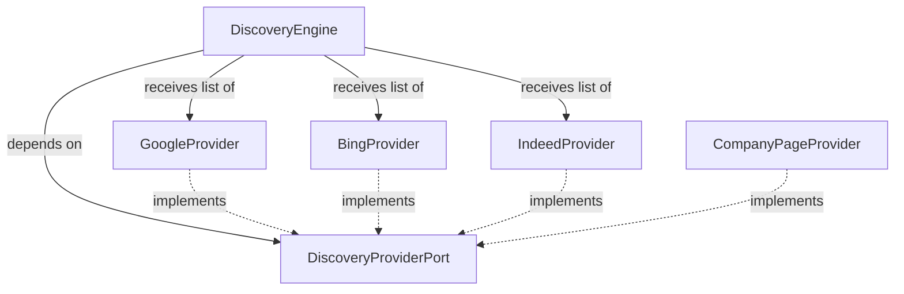
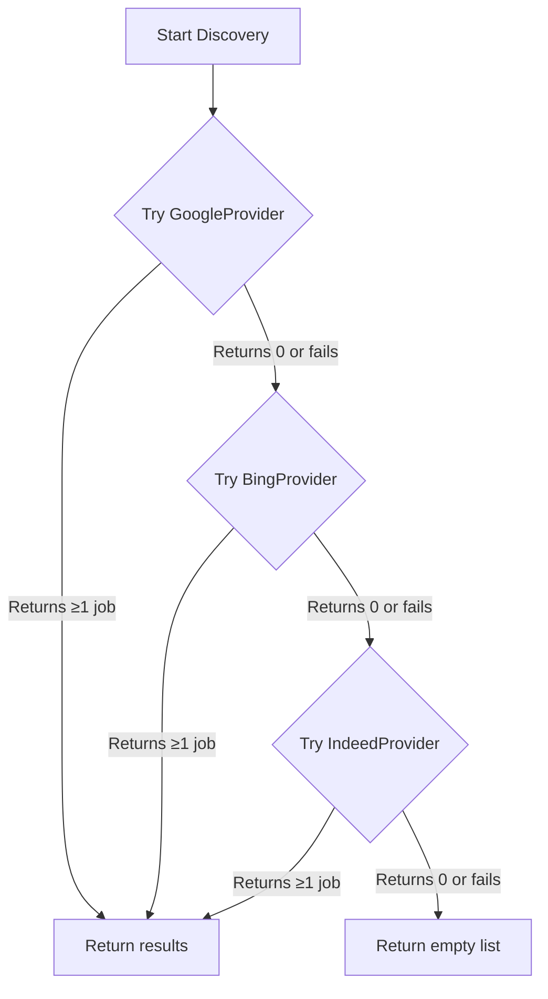

# Discovery Strategies

The Discovery Engine is AA’s job‑hunting scout. It does not know how to
search Google or Bing or Indeed. It only knows how to ask a **provider** to
“go find jobs.” Which provider, which website, which scraping technique — all
of that is injected. This chapter explains the Strategy Pattern that makes the
Discovery Engine adaptable, the ResilientNavigator that gives every provider a
fallback plan, and the internal machinery that turns a search results page
into a list of structured Job objects.

---

## The Strategy Pattern

AA’s Discovery layer follows the **Strategy Pattern**. Instead of one giant
“scrape everything” function, we have many small, independent **provider**
classes. Each provider knows how to scrape exactly one source — Google,
Bing, Indeed, or a company’s careers page.

Every provider must satisfy the `DiscoveryProviderPort` contract, which the
Discovery Engine depends on. The engine is a pure orchestrator: it asks
each injected provider to `run()`, collects the results, deduplicates by URL,
and returns them to the AgentOrchestrator.



The composition root builds the list of providers and injects it into the
engine. The engine calls `provider.run()` on each one, in order. If a
provider fails (CAPTCHA, network error, layout change), the engine logs the
error and continues to the next provider — one failure never aborts the
entire search.

### The DiscoveryProviderPort Contract

```python
class DiscoveryProviderPort(ABC):
    @property
    def name(self) -> str: ...
    
    @property
    def requires_live_browser(self) -> bool: ...
    
    def run(self, override_criteria: dict | None = None) -> list[Job]: ...
```

| Method | Purpose |
| ------ | ------- |
| `name` | Canonical lowercase identifier: `"google"`, `"bing"`, `"indeed"`. |
| `requires_live_browser` | Returns `True` if this provider needs a real browser. The composition root excludes browser‑dependent providers when no browser is available. |
| `run(criteria)` | Execute the search and return a list of Job objects. May be empty; never `None`. |

---

## How a Provider Works: Inside GoogleProvider

Let’s trace what happens when the engine calls `GoogleProvider.run()`.

### 1. Construct the Search URL

The provider reads the user’s desired job titles and locations from the
profile, then builds a Google Jobs URL:

```python
query = f"{title} jobs in {location}"
url = f"https://www.google.com/search?q={query}&ibp=htl;jobs"
```

### 2. Navigate — with a Fallback Plan

Instead of a single `browser.get(url)` call, the provider uses a
**ResilientNavigator** (see below). The navigator first tries to load the URL
directly. If the page comes back with a CAPTCHA or block, it resets the
browser state (clearing cookies) and tries again, this time by navigating to
the Google homepage, typing the query into the search bar, and clicking the
search button — a slower but much more human‑looking path.

### 3. Extract Job Listings

Once on the results page, the provider first checks for **JSON‑LD structured
data** embedded in the HTML. Many job boards embed job postings as
`application/ld+json` blocks, which are easier and faster to parse than
HTML. If JSON‑LD is present, the provider extracts titles, company names, and
URLs directly from the structured data.

If JSON‑LD is not available, the provider deploys a **GenericSERPStrategy** —
a reusable scraping component that:

1. **Classifies the page** — is it a search results page, a CAPTCHA block, a
   login wall, or an error page? If the page is not a healthy SERP, the
   provider aborts immediately.
2. **Dismisses interruptions** — cookie banners, GDPR consent popups, and
   modal overlays are clicked away so they don’t block job cards.
3. **Scrolls for infinite‑loading pages** — the `InfiniteScrollStrategy` scrolls
   down in increments, waits for new content to load, and detects when the
   feed is exhausted. This handles virtualised lists (Google Jobs widget) where
   only a few cards are in the DOM at any moment.
4. **Mines job cards** — the `SemanticMiner` scans the DOM for semantic
   containers (`role="tree"`, `role="list"`, `role="feed"`) and extracts
   titles, company names, and URLs from each card using heuristic selectors.
5. **Deduplicates within the page** — cards that appear multiple times as the
   user scrolls are merged by URL.

### 4. Return Results

The provider returns a list of `Job` objects, each with `title`, `company`,
`url`, `source`, and `location`. The Discovery Engine then deduplicates across
all providers — the first provider to return a given URL wins.

---

## The ResilientNavigator

Navigation is the most failure‑prone part of any scraping operation. Websites
block IPs, throw CAPTCHAs, or simply change their URL structure. The
`ResilientNavigator` gives every provider a built‑in fallback plan.

It is a composite that holds an ordered list of `NavigationStrategy`
implementations and tries them one by one until a page loads and passes a
health check.

```python
class ResilientNavigator:
    def __init__(self, browser, strategies):
        self._strategies = strategies  # ordered list

    def navigate_with_fallback(self, url, context, validator):
        for strategy in self._strategies:
            strategy.navigate(url, context)
            if validator():           # e.g., "is this a SERP, not a CAPTCHA?"
                return True
            # Reset browser state before next attempt
            browser.get("about:blank")
        return False
```

The two primary navigation strategies are:

| Strategy | Behaviour | Detectability |
| -------- | --------- | ------------- |
| `DirectURLNavigation` | Navigate directly to the constructed search URL. Fastest. | Higher — direct parameterised URLs look like bots. |
| `HumanSearchNavigation` | Navigate to the homepage, type the query into the search bar, and click the search button. Slower, with parabolic typing delays. | Lower — mimics a real user typing a query. |

If `DirectURLNavigation` loads a page that fails the health check (CAPTCHA
detected), the navigator resets the browser state and retries with
`HumanSearchNavigation`. This gives every provider two independent ways to
reach the same results page, dramatically increasing the chance of success.

---

## Adaptive Search Manager

The `DiscoveryEngine` functions as an **Adaptive Search Manager**. It does
not run all providers unconditionally. Instead, it loops through them in
priority order and **stops as soon as it gets results**.



This means:

- If Google returns 50 jobs, AA never even touches Bing or Indeed — saving
  bandwidth and reducing the footprint on job boards.
- If Google is down or blocking, AA moves silently to Bing.
- If all providers fail, AA returns an empty list and the orchestrator logs
  a warning. The session is not aborted — the user can retry later or switch
  to Direct Links mode.

---

## The Multi‑Query Loop

The Discovery Engine does not perform a single search. For every combination
of **desired job title × preferred location × workplace type**, it generates a
separate query. If the user’s profile has two job titles, three locations, and
two workplace types, the engine runs up to 12 queries — each potentially
returning dozens of results.

This is capped by `max_discovery_results_per_query` and `max_queries_per_session`
in `runtime_defaults.yaml` to prevent resource exhaustion on low‑end machines.

---

## Adding a New Discovery Provider

To add a new job board (e.g., LinkedIn), you only need to write one class
and register it in one place.

1.  Create a new file in `adapters/secondary/discovery/providers/`:
    ```python
    from auto_apply.domain.ports.discovery_port import DiscoveryProviderPort
    from auto_apply.adapters.secondary.discovery.strategies.navigators import (
        DirectURLNavigation,
        HumanSearchNavigation,
        ResilientNavigator,
    )

    class LinkedInProvider(DiscoveryProviderPort):
        name = "linkedin"
        requires_live_browser = True

        def __init__(self, browser, search_prefs):
            self._browser = browser
            self._prefs = search_prefs
            self._navigator = ResilientNavigator(browser, [
                DirectURLNavigation(browser),
                HumanSearchNavigation(browser),
            ])

        def run(self, override_criteria=None):
            # build LinkedIn search URL, navigate, mine jobs...
            return jobs
    ```

2.  Register the provider in the composition root:
    ```python
    providers.append(LinkedInProvider(browser, search_prefs))
    ```

No other files need to change. The Discovery Engine, the orchestrator, and
every workflow that depends on discovery will automatically use the new
provider.

---

## Company Career Page Discovery

Not all jobs are found via search engines. Sometimes a user knows exactly
which company they want to work for and provides a direct link to the
company’s careers page. AA supports this via `DISCOVER_COMPANY` tasks.

When given a URL like `https://acme.com/careers`, AA:

1.  Navigates to the page.
2.  Scans the navigation menus (using `ToolbarNavigator`) for links containing
    “jobs,” “careers,” “open positions,” etc.
3.  Follows the best matching link to the actual job listings page.
4.  Applies the same `GenericSERPStrategy` to extract all job cards.
5.  Returns the list of jobs, which then flows through the normal vetting
    pipeline.

This allows AA to handle both broad “search the web” and targeted “apply
everywhere at this company” workflows with the same underlying machinery.

---

## Graceful Degradation

The Discovery layer respects AA’s worst‑case‑first philosophy at every level:

| Condition | Behaviour |
| --------- | --------- |
| No live browser available | Browser‑dependent providers are excluded from the provider list. Only static‑fetch providers (future) run. |
| A provider raises an exception | The exception is caught, logged, and the engine moves to the next provider. |
| A provider returns zero results | The engine tries the next provider. |
| `SpaCy` is not installed | The `TextMatcher` falls back to `difflib.SequenceMatcher` for title matching inside providers. |
| `ATSRegistry` fails to load | The `_ats_site_filters` helper falls back to a hardcoded list of common ATS domains. |

---

## Architecture Summary

- **Providers** are concrete implementations of `DiscoveryProviderPort`. They
  encapsulate all knowledge of a specific website’s URL structure, selectors,
  and quirks.
- **The ResilientNavigator** gives every provider a fallback navigation chain.
- **The Discovery Engine** is a pure orchestrator — it depends only on the
  port, not on any specific provider.
- **Extensibility** is trivial: a new job board is one file + one registration
  line.

This design ensures that AA can adapt to new job boards, survive website
changes, and continue to find jobs even when specific search engines are
unavailable — all without changing the core application logic.

---

## Next Steps

- [Vetting Pipeline](vetting_pipeline.md) — what happens after jobs are
  discovered: how AA decides which ones to apply to.
- [Core Abstractions](core_abstractions.md) — the `DiscoveryProviderPort`
  contract and dependency injection in action.
- [ADR‑004: ATS Platform Registry](../adr/004_ats_platform_registry.md) —
  how AA identifies which ATS a job is hosted on.