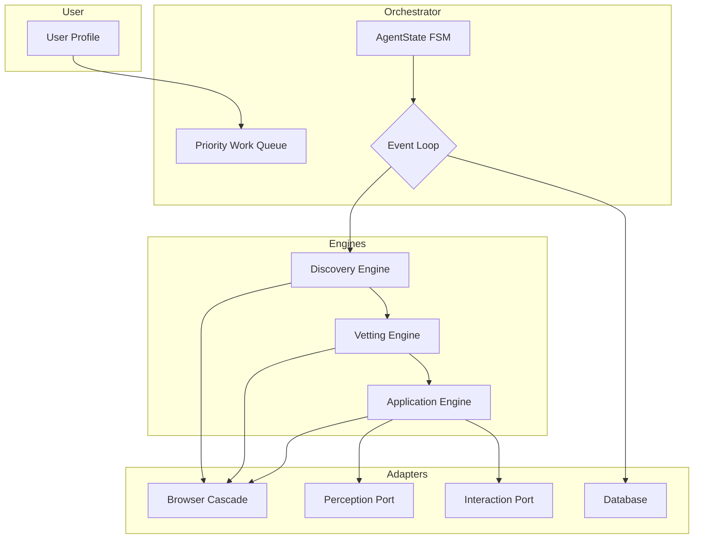

# Architecture Deep Dive

AutoApply is built on a **hexagonal (ports & adapters) architecture**. Every
design choice was made to satisfy one overriding constraint: **the software
must work perfectly on the weakest machine first**, then scale up for everyone
else.

This section explains *how* and *why* the system is organised the way it is.
You will find detailed walk‑throughs of the agent lifecycle, the browser
abstraction layer, the evasion framework, and every pipeline stage from
discovery to application.

---

## The Big Picture

AA is a pipeline that transforms a user profile into submitted job
applications, with safety gates and human review checkpoints along the way.



1.  **User Profile** is loaded and validated.
2.  **Discovery Engine** finds job listings using Google, Bing, Indeed, and
    direct company pages.
3.  **Vetting Pipeline** filters jobs against the user's criteria — title,
    skills, location, commute distance, company blacklists.
4.  **Application Engine** fills out and submits forms, pausing at
    configurable checkpoints for human approval.
5.  **Everything** is coordinated by the `AgentOrchestrator`, which operates
    as an event‑driven priority‑queue dispatcher with crash recovery.

---

## Architectural Principles

These principles are non‑negotiable. Every line of code is judged against
them.

| Principle | What it means in AA |
| --------- | ------------------- |
| **Worst‑case first** | The default install (~30 MB) works on a library PC with 2 GB RAM, no GPU, and no admin rights. Premium tiers (SpaCy, GPT4All) are opt‑in. |
| **Framework agnostic** | AA does not care whether the browser is driven by Selenium, Playwright, or a future tool. All browser interactions go through `BrowserInterface`. |
| **Graceful degradation** | Every capability has a lightweight fallback. No browser? Use static HTML. No SpaCy? Use `difflib`. No GPT4All? Use SpaCy‑ranked paragraphs. |
| **Dependency inversion** | The domain layer defines *what* it needs (ports). Adapters implement *how* it is done. The composition root is the only place that knows about both. |
| **Defence in depth** | Evasion is multi‑layered: browser fingerprint hardening, behavioural humanisation, session integrity, and CAPTCHA handling. |
| **Research grade** | The optional research module collects anonymised, consent‑gated signals suitable for academic analysis — zero PII, uniform schema, CSV export. |

---

## Key Design Decisions

Every major architectural choice is recorded as an **Architecture Decision
Record (ADR)** in the `adr/` directory. Here are the highlights:

| ADR | Decision | Why |
| --- | -------- | --- |
| [ADR‑001](../adr/001_hexagonal_architecture.md) | Hexagonal (ports & adapters) architecture | Isolates business logic from infrastructure; enables testing without browsers or databases. |
| [ADR‑002](../adr/002_dependency_injection_refactor.md) | Constructor injection everywhere | Every component receives its dependencies; nothing constructs its own. Testable in isolation. |
| [ADR‑003](../adr/003_pra_loop_and_state_machine.md) | Dual state machines (AgentState + ApplicationState) | Explicit, guarded transitions prevent impossible states and make the agent's behaviour auditable. |
| [ADR‑004](../adr/004_ats_platform_registry.md) | YAML‑driven ATS platform detection | Adding a new ATS requires zero Python changes — just a YAML file in `resources/ats/`. |
| [ADR‑005](../adr/005_human_in_the_loop.md) | Pluggable interrupt policy | Users control when AA pauses for approval; admins can enforce checkpoints via policy. |
| [ADR‑006](../adr/006_bs4_zero_browser_fallback.md) | Static HTML perception via BeautifulSoup | The agent works even when no browser can be launched — essential for worst‑case users. |
| [ADR‑007](../adr/007_profile_and_schema_driven_ui.md) | Schema‑driven UI from Pydantic models | Adding a profile field automatically updates the GUI and CLI; eliminates hardcoded field lists. |
| [ADR‑008](../adr/008_plugin_architecture.md) | Protocol‑based plugin system | New discovery providers, perception adapters, and filters are added by implementing a port and wiring it in the composition root. |
| [ADR‑009](../adr/009_research_module.md) | Consent‑gated, zero‑PII research telemetry | Ethical data collection that is passive, anonymised, and opt‑in only. |
| [ADR‑010](../adr/010_remediation_changelog.md) | Architecture audit and remediation sprint | Record of every layering violation fixed, every dependency injected, and every crash resolved during the pre‑alpha cleanup. |

---

## In This Section

| Document | What you'll learn |
| -------- | ----------------- |
| [Agent Lifecycle](agent_lifecycle.md) | The `AgentOrchestrator` state machine, priority work queue, event‑driven dispatch, checkpoint recovery, and health monitoring. |
| [Core Abstractions](core_abstractions.md) | `BrowserInterface`, the port/adapter pattern, dependency injection, and the composition root — the backbone of AA's framework‑agnostic design. |
| [Browser Cascade](browser_cascade.md) | How AA selects a browser: the `DriverProvider` registry, the fallback chain (Playwright → Selenium → static), and the candidate priority matrix. |
| [Evasion Framework](evasion_framework.md) | Multi‑layered defence against bot detection: fingerprint hardening, behavioural humanisation, session integrity, and active challenge handling. |
| [Discovery Strategies](discovery_strategies.md) | The Strategy Pattern for job search: Google, Bing, Indeed, company pages, and the `AdaptiveSearchManager` that tries them in sequence until one succeeds. |
| [Vetting Pipeline](vetting_pipeline.md) | How AA decides which jobs to apply to: the composable filter chain, NLP scoring, GPT4All borderline reasoning, and weighted fit scores. |
| [Application Engine](application_engine.md) | The Scan‑Plan‑Act loop, the `ApplicationState` FSM, heuristic form filling, AI‑powered custom answers, and human‑in‑the‑loop checkpoints. |

---

## The Layer Map

AA's code is organised into four strict layers. Dependencies only point
inward — outer layers know about inner layers, never the reverse.

```
infrastructure/       ← wires everything (composition root, providers, cascade)
    ↓
adapters/             ← implements ports (browser drivers, HTTP clients, DB)
    ↓
application/          ← use cases, orchestrator, workflows, services
    ↓
domain/               ← pure business logic (models, ports, filters, services)
```

- **`domain/`** — No imports from `adapters/` or `infrastructure/`. Pure Python
  with one exception: Pydantic for data validation and schema generation.
- **`application/`** — Orchestrates the domain; depends on domain ports, never
  on adapters directly.
- **`adapters/`** — Implements the ports defined in `domain/ports/`. Primary
  adapters (GUI, CLI) drive the app; secondary adapters (browser, DB) are
  driven by the app.
- **`infrastructure/`** — The composition root. The **only** place that may
  import from both `adapters/` and `domain/` simultaneously.

---

## Next Steps

Start with the **[Agent Lifecycle](agent_lifecycle.md)** for a tour of the
orchestrator, or jump to **[Core Abstractions](core_abstractions.md)** to
understand the framework‑agnostic interfaces that make everything else possible.

If you are a contributor adding a new feature, read the relevant ADR first —
it will explain the reasoning behind the existing design.