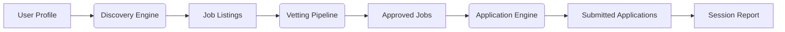

# AutoApply Agent

**An autonomous, open‑source agent for discovering, vetting, and applying for jobs.**

[](https://www.python.org/downloads/)
[](https://github.com/Liebmann5/AA/blob/main/LICENSE)
[](https://github.com/Liebmann5/AA)

---
## Shout Outs

<div align="center">
   CHELSEA DAHL

   <br>

   *This project would've never been possible without the kindness and support of Chelsea, Grant, and everyone else from the Austin, TX office! I could never thank them enough!*
</div>

---
## Vision

Job hunting is broken. Candidates spend hours re‑typing the same information into
dozens of forms, while companies rely on opaque ATS filters that discard qualified
people for arbitrary reasons. **AutoApply exists to make this process fair, fast,
and fully automatic — for everyone, regardless of their hardware, budget, or
technical skill.**

We built AA on three non‑negotiable beliefs:

1. **No one should pay to apply for a job.** AA is 100% free and open source.
2. **The software must work on the weakest machine.** AA’s “worst‑case first”
   design guarantees that a library computer with 2 GB RAM and no admin rights is
   a fully supported platform.
3. **Automation must be safe, transparent, and under the user’s control.**
   Every submission can be reviewed, paused, or cancelled. No data leaves your
   device without explicit consent.

---

## Current Status

**Alpha — actively developed.** The core engine works end‑to‑end on Windows,
macOS, and Linux. We are currently hardening the portable USB experience,
completing the tier‑ed dependency system, and writing the final documentation
you are reading now.

| Feature                      | Status      |
| ---------------------------- | ----------- |
| Multi‑provider job discovery | ✅ Stable   |
| Filtering & vetting pipeline | ✅ Stable   |
| Form‑filling engine          | ✅ Stable   |
| Human‑in‑the‑loop checkpoints| ✅ Stable   |
| GUI (Tkinter) & CLI          | ✅ Stable   |
| Browser cascade (Selenium → Playwright → static) | ✅ Stable |
| USB portable mode            | ⚙️ In Progress |
| PyInstaller one‑file build   | ⚙️ In Progress |
| Offline NLP (SpaCy)          | ✅ Optional |
| Offline LLM (GPT4All)        | ✅ Optional |

---

## Quick Start (30 seconds)

```bash
pip install auto_apply
python -m auto_apply
```

The first launch opens the **Setup Wizard** — you only need to do this once.
After that, every job hunt is a single click or command.

Already know the drill? Jump to the **[Installation Guide](getting_started/installation.md)**
for all options (pip, uv, USB portable, PyInstaller .exe).

---

## Who Is This For?

| You are … | Start here |
| --------- | ---------- |
| A job seeker who wants to try AA right now | [Quick Start](getting_started/quick_start.md) |
| A non‑technical user who needs a step‑by‑step walkthrough | [User Guide](user_guide/index.md) |
| An IT admin deploying AA in a library, school, or enterprise | [Admin Policy Guide](user_guide/admin_policy.md) |
| A developer who wants to contribute or extend AA | [Developer Guide](developer_guide/index.md) |
| A researcher studying the hiring market | [Research Module](research_module/index.md) |

---

## How AA Works (the big picture)



1. **Discovery** – Searches Google, Bing, Indeed, and company career pages
   simultaneously. Works with a live browser (Selenium/Playwright) or falls back
   to static HTML when no browser is available.
2. **Vetting** – Filters jobs against your preferences (title, location, skills,
   salary, commute distance). Uses SpaCy for smart matching, or falls back to
   built‑in string similarity.
3. **Application** – Fills out forms automatically using your profile data.
   Pauses at critical checkpoints so you can review before submitting.
4. **Research (optional)** – If you opt in, AA records anonymised hiring‑market
   signals that help us study and improve the job market.

---

## Tiered Features — No User Left Behind

AA is designed to **degrade gracefully**. The core experience runs on a
library computer with 2 GB RAM and no GPU. Users with better hardware can
opt into richer features.

| Tier | Install command | What you get |
| ---- | --------------- | ------------ |
| **Core** (default) | `pip install auto_apply` | Selenium‑based automation, static‑HTML fallback, form filling, all vetting filters, research module |
| **NLP** (recommended) | `pip install "auto_apply[nlp]"` | SpaCy entity extraction, semantic title matching, smarter form‑field classification |
| **AI** (premium) | `pip install "auto_apply[ai]"` | GPT4All local LLM for answering open‑ended questions and borderline vetting decisions |
| **Full** | `pip install "auto_apply[full]"` | Everything above, plus offline CAPTCHA solving (experimental) |

*No internet? AA works fully offline after the initial install. See the
[Installation Guide](getting_started/installation.md) for details.*

---

## USB Portable Mode

Plug AA into any computer and run it directly from a flash drive — no
installation, no admin rights, no traces left behind.

- **All data stays on the drive** — profiles, databases, logs, and caches.
- **Portable browsers** are bundled on the drive (Chromium Portable).
- **Admin policy** files on the drive are automatically respected.
- **Verification mode** (`--verify-portable`) proves zero host‑machine leakage.

Read the full guide in **[PyInstaller Portable Build](deployment/pyinstaller_portable.md)**.

---

## Architecture & Design

AA is built with a **hexagonal (ports & adapters) architecture** that keeps
business logic completely separate from browser automation, persistence, and
UI code. Every design decision is recorded as an
**[Architecture Decision Record](adr/index.md)**.

Key principles:

- **Framework‑agnostic** — Selenium, Playwright, or anything that satisfies
  `BrowserInterface`.
- **Provider‑agnostic** — new job boards or ATS platforms are added via YAML,
  not code.
- **Graceful degradation** — every capability has a lightweight fallback.
- **Defence in depth** — multi‑layered evasion (fingerprinting, behavioural,
  network, CAPTCHA).

---

## Documentation Map

| Section | What you'll find |
| ------- | ---------------- |
| [Getting Started](getting_started/index.md) | Installation, quick start, profile setup |
| [User Guide](user_guide/index.md) | How to use AA day‑to‑day, privacy, admin policy |
| [Developer Guide](developer_guide/index.md) | Setup, testing, contributing, architectural overview |
| [Architecture Deep Dive](architecture/index.md) | State machines, abstractions, evasion, discovery, vetting, applications |
| [Deployment](deployment/index.md) | Docker, PyInstaller portable build, enterprise policy |
| [Research Module](research_module/index.md) | Signal taxonomy, CSV format, privacy guarantees |
| [API Reference](api_reference/index.md) | Auto‑generated from docstrings |
| [ADRs](adr/index.md) | Record of every major architectural decision |
| [FAQ](faq.md) | Common errors and how to fix them |
| [Glossary](glossary.md) | Definitions of key terms |

---

## License & Community

AutoApply is MIT‑licensed. Contributions are welcome — please read the
[Contribution Guide](developer_guide/contribution_workflow.md) before opening a
pull request.

If you find a bug or have a feature idea, open an issue on
[GitHub](https://github.com/Liebmann5/AA/issues).

---

*“The purpose of AA was to provide people/candidates with the same automating computer programs that companies utilize to expedite and simplify the hiring process — then provide the data to build something better.”*


---

This `index.md` covers the project vision, current status, tiered features, portability, architecture principles, and a full documentation map. I can now move on to any specific file you'd like fleshed out next — for example, the installation guide, the PyInstaller portable build guide, or the first Architecture Decision Record. Just tell me where you want to go.