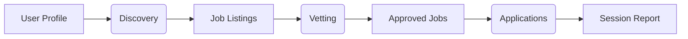

# AutoApply

**Deterministic, local, zero-shot comprehension of unfamiliar web interfaces —
applied to job applications.**

---

!!! warning "AutoApply is pre-alpha and has never submitted an application"

    The most recent full live run made 18 attempts and produced 0 submissions:
    13 stopped by CAPTCHA, 5 by login walls. That result is published rather
    than withheld.

    **[STATUS.md](STATUS.md) is the single source of truth for what works.**
    Every page on this site defers to it.

---

## The claim

A local program, on commodity hardware, with no network AI, no API keys and no
site-specific knowledge, can comprehend an unfamiliar web interface well enough
to operate it — and produce a verifiable record of what it encountered.

AA reads pages *geometrically* rather than through hardcoded selectors:
Kuhn–Munkres assignment pairs labels with inputs, convex hulls and VIPS-style
segmentation identify regions, structural hashing deliberately ignores CSS class
names, entropy and occlusion measures expose honeypots. `[LIVE]`

There is no per-site selector table, because a selector table cannot describe a
page nobody has seen. Advice to "just hardcode the selectors for the site that
is not working" is advice to abandon the claim the project exists to test.

**The constraint is the contribution.** Comprehending a page with a frontier
model costs a few cents and proves nothing new. Doing it with geometry and
constraint solving on a four-gigabyte library computer, from a USB stick, with
no administrator rights, is the novel part — and the only configuration in which
determinism, reproducibility and research-grade data survive together.

This claim may be false. The counter-arguments are stated at full strength in
the [Architecture Bible](AA_ARCHITECTURE_BIBLE.md).

---

## Three commitments

1. **No one should pay to apply for a job.** AA is free, MIT-licensed, and needs
   no account, subscription or API key.
2. **The software must work on the weakest machine.** A shared library computer
   with 4 GB of RAM and no administrator rights is a supported platform, not an
   edge case.
3. **Automation must be transparent and under the user's control.** Every
   submission can be reviewed, paused or cancelled. Enabling autonomy takes two
   explicit acknowledgements. Nothing is installed on your device without being
   asked first.

---

## Start here

| You are… | Go to |
| --- | --- |
| Wondering whether AA works yet | [Project Status](STATUS.md) |
| Installing AA for the first time | [Installation](getting_started/installation.md) |
| Running your first session | [Quick Start](getting_started/quick_start.md) |
| Using AA day to day | [User Guide](user_guide/index.md) |
| Deploying to a library or school | [Admin Policy](user_guide/admin_policy.md) |
| Contributing code | [Contributing](https://github.com/Liebmann5/AA/blob/main/CONTRIBUTING.md) |
| Understanding the architecture | [Architecture](architecture/index.md) |
| Looking something up | [Reference](reference/index.md) |
| Using AA's research output | [Research Module](research_module/index.md) |

---

## How AA works

```mermaid
graph LR
    A[User Profile] --> B(Discovery)
    B --> C[Job Listings]
    C --> D(Vetting)
    D --> E[Approved Jobs]
    E --> F(Applications)
    F --> G[Session Report]
```

1. **Discovery** searches Google, Bing and Indeed. `[PARTIAL]` — only Bing has
   yielded real postings in a live run.
2. **Vetting** filters postings against your profile: title, location, skills,
   salary, commute. `[LIVE]` SpaCy sharpens the matching when installed;
   built-in string similarity is used otherwise. `[LIVE]`
3. **Applications** fill forms from your profile and pause at human-in-the-loop
   checkpoints. `[WIRED]` Submission is fail-closed: AA refuses rather than
   submitting work it cannot prove correct. `[LIVE]`
4. **Research** — if you opt in — records anonymised hiring-market signals.
   `[LIVE]`, off by default.

The three engines share one priority queue, so a single search flows discover →
vet → apply before the next search begins ([ADR-011](adr/011_discovery_pipeline_priority.md)).

---

## What AA requires

- Python 3.10 or newer.
- **A browser.** Chrome, Chromium, Firefox or Edge. AA no longer operates
  without one; it refuses to start a session rather than pretending
  ([ADR-013](adr/013_static_path_retirement.md)).
- Roughly 300 MB of disk for a core install.
- No administrator rights, no API keys, no network service.

Optional tiers add capability without ever becoming required:

| Extra | Adds |
| --- | --- |
| `nlp` | SpaCy entity extraction and semantic title matching |
| `semantic` | sentence-transformers role alignment |
| `browser` | Playwright |
| `ai` | GPT4All, a local LLM for open-ended answers |
| `stealth` | undetected-chromedriver |
| `research` | Parquet export via pyarrow and pandas |
| `all` | Everything above |

Every extra is opt-in, installed by you, downloaded with your knowledge. See
[Installation](getting_started/installation.md).

---

## Portable mode

AA runs from a USB stick. Profiles, the database, logs and caches stay on the
drive. `[PARTIAL]` — it runs, and `launch_portable.sh` has known containment
defects recorded in [STATUS.md](STATUS.md). Do not treat "no traces on the host"
as proven until that line changes.

---

## Architecture in one paragraph

AA is hexagonal. The domain holds pure models, ports and algorithms with no
knowledge of any framework. The application layer orchestrates workflows.
Adapters implement ports against Selenium, Playwright, SQLite, Tkinter and the
terminal. The composition root is the only place that wires them together, and
layer-boundary violations are asserted at an exact count by an architecture pin.

Read the [architecture section](architecture/index.md) for the parts, and the
[ADR index](adr/index.md) for why each part is shaped the way it is.

---

## Licence and citation

MIT. If you use AA in research, cite it with
[CITATION.cff](https://github.com/Liebmann5/AA/blob/main/CITATION.cff) and read
[REPRODUCIBILITY.md](REPRODUCIBILITY.md).

Before your first run, read the
[disclaimer](https://github.com/Liebmann5/AA/blob/main/DISCLAIMER.md) and
[ETHICS.md](ETHICS.md). Automating job-board interaction may conflict with a
site's terms of service, and that decision is yours.

---

> *The purpose of AA was to provide candidates with the same automating programs
> companies use to expedite hiring — then provide the data to build something
> better.*

## Acknowledgements

This project would not exist without the kindness and support of Chelsea Dahl,
Grant, and everyone else from the Austin, TX office.
